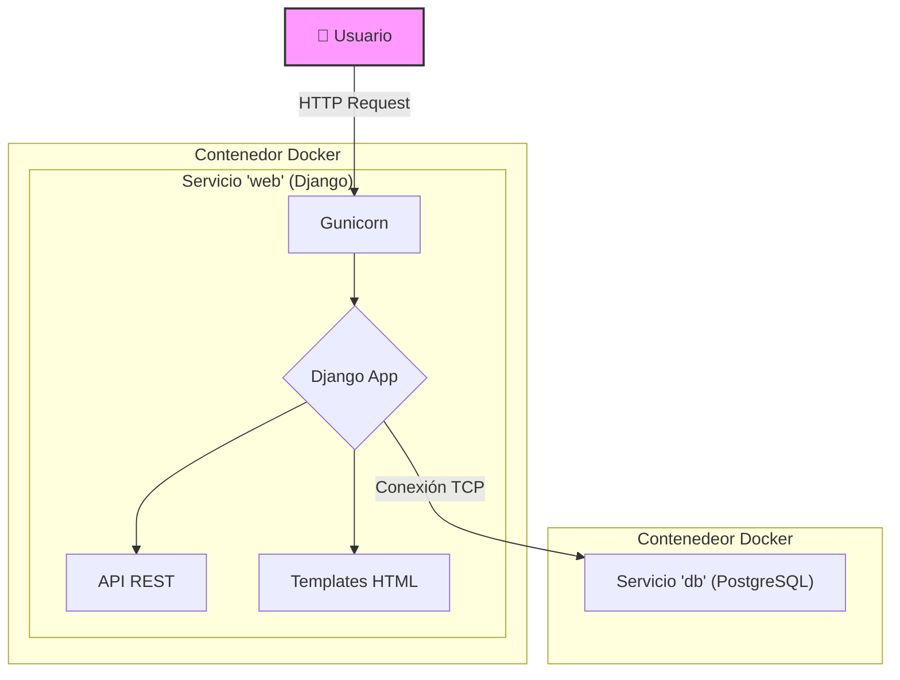

# Arquitectura del Sistema

El proyecto sigue una arquitectura monolítica basada en Django, orquestada a través de Docker Compose.

## Diagrama de Arquitectura

El siguiente diagrama ilustra los componentes principales y cómo interactúan entre sí.

### Componentes

- **Usuario**: Interactúa con la aplicación a través de un navegador web.
- **Servicio 'web'**: Un contenedor Docker que ejecuta la aplicación Django a través del servidor Gunicorn. Sirve tanto el frontend (vistas renderizadas con templates de Django) como la API REST.
- **Servicio 'db'**: Un contenedor Docker que ejecuta la base de datos PostgreSQL, donde se almacenan todos los datos de la aplicación.
- **Docker Compose**: Orquesta el levantamiento y la comunicación entre los servicios `web` y `db`.