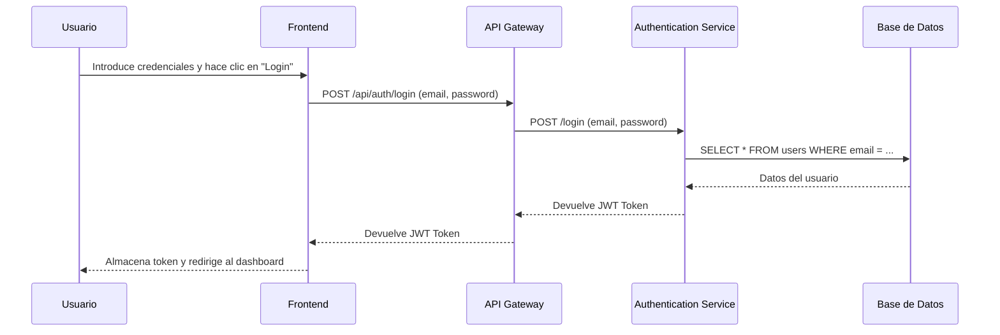

# Arquitectura Detallada y Flujos de Datos

En esta sección, se detallan flujos de trabajo específicos para entender mejor cómo viajan los datos a través del sistema.

## Flujo de Autenticación de Usuario

El siguiente diagrama de secuencia muestra los pasos que se siguen cuando un usuario inicia sesión en la plataforma.

1.  El usuario introduce sus credenciales en el **Frontend** y envía la petición.
2.  El **Frontend** envía las credenciales al **API Gateway**.
3.  El **API Gateway** redirige la petición al microservicio de **Autenticación**.
4.  El servicio de **Autenticación** verifica las credenciales contra la información almacenada en la **Base de Datos**.
5.  Si las credenciales son válidas, el servicio genera un token (por ejemplo, JWT) y lo devuelve.
6.  El token viaja de vuelta a través del **API Gateway** hasta el **Frontend**, donde se almacena para futuras peticiones autenticadas.

