# Visión General de la Arquitectura

El proyecto "Red Social para Deportistas" está diseñado siguiendo una **arquitectura de microservicios**. Este enfoque nos permite desarrollar, desplegar y escalar cada componente del sistema de forma independiente, ofreciendo mayor flexibilidad y resiliencia.

## Componentes Principales

El sistema se compone de los siguientes servicios:

- **Frontend**: La aplicación web con la que interactúan los usuarios, construida probablemente con un framework como React, Angular o Vue.
- **API Gateway**: Es el único punto de entrada para todas las peticiones del cliente. Enruta las peticiones al microservicio correspondiente, simplificando la comunicación y añadiendo una capa de seguridad.
- **Microservicios de Backend**:
  - `authentication-service`: Gestiona el registro, inicio de sesión y la validación de tokens de los usuarios.
  - `data-management-service`: Se encarga de la lógica de negocio principal (perfiles, publicaciones, etc.).
  - `notifications-service`: Gestiona y envía notificaciones a los usuarios.
  - `analytics-service`: Recopila y procesa datos para generar métricas y analíticas.
- **Base de Datos**: Una instancia de PostgreSQL que sirve como almacenamiento persistente para todos los microservicios que lo requieran.

## Diagrama de Flujo de la Arquitectura

El siguiente diagrama ilustra cómo interactúan los diferentes componentes del sistema. El usuario final solo se comunica con el **Frontend**, que a su vez consume el **API Gateway**.

```mermaid
graph TD
    subgraph "Cliente"
        Usuario(👤 Usuario Final)
    end

    subgraph "Infraestructura Desplegada"
        Frontend(🌐 Frontend)
        APIGateway(🚪 API Gateway)
        
        subgraph "Microservicios"
            Auth[authentication-service]
            Data[data-management-service]
            Notifications[notifications-service]
            Analytics[analytics-service]
        end

        DB[(🗄️ Base de Datos <br> PostgreSQL)]
    end

    Usuario --> Frontend
    Frontend --> APIGateway
    APIGateway --> Auth
    APIGateway --> Data
    APIGateway --> Notifications
    APIGateway --> Analytics
    
    Auth --> DB
    Data --> DB
    Notifications --> DB
    Analytics --> DB
```

